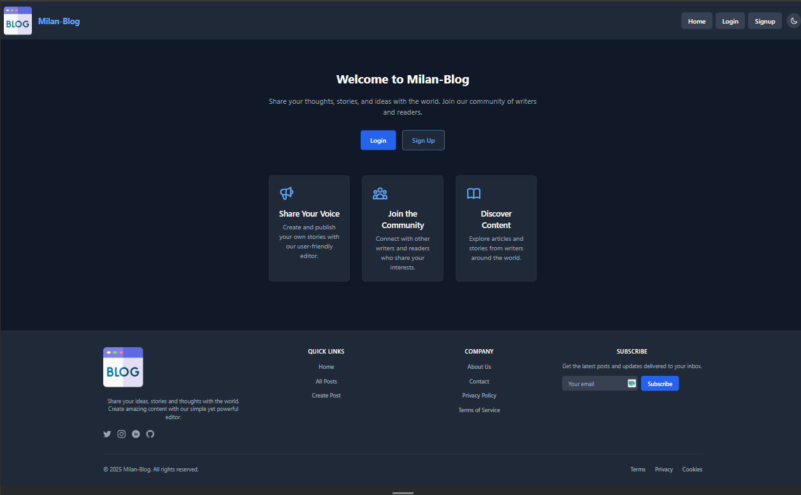

# Milan-Blog - A Modern Blogging Platform

A full-featured blogging platform built with React and Appwrite backend, featuring user authentication, rich text editing, and image upload capabilities.



## 🌐 Live Demo

Visit the live demo: [Milan-Blog](https://your-site-name.netlify.app)

> Note: The demo site is currently under deployment. Please check back soon!

## 🌟 Features

- **User Authentication**
  - Email/Password signup and login
  - Protected routes
  - Session management

- **Blog Post Management**
  - Create, edit, and delete posts
  - Rich text editor for content
  - Image upload support
  - Post status management (active/inactive)

- **User Experience**
  - Responsive design
  - Dark/Light mode
  - Real-time updates
  - Loading states
  - Error handling

## 🚀 Tech Stack

- **Frontend**
  - React 18
  - Vite
  - Redux Toolkit
  - React Router
  - React Hook Form
  - TinyMCE Editor
  - Tailwind CSS

- **Backend**
  - Appwrite
    - Authentication
    - Database
    - Storage
    - Real-time updates

## 🛠️ Installation

1. **Clone the repository**
   ```bash
   git clone https://github.com/Milan-Lamsal/React-Journey.git
   cd 12BlogAppwrite
   ```

2. **Install dependencies**
   ```bash
   npm install
   ```

3. **Set up environment variables**
   Create a `.env` file in the root directory:
   ```
   VITE_APPWRITE_URL=your_appwrite_url
   VITE_APPWRITE_PROJECT_ID=your_project_id
   VITE_APPWRITE_DATABASE_ID=your_database_id
   VITE_APPWRITE_COLLECTION_ID=your_collection_id
   VITE_APPWRITE_BUCKET_ID=your_bucket_id
   ```

4. **Start the development server**
   ```bash
   npm run dev
   ```

## 📝 Project Structure

```
src/
├── appwrite/           # Appwrite service configurations
├── components/         # Reusable UI components
├── pages/             # Page components
├── store/             # Redux store and slices
└── utils/             # Utility functions
```

## 🔒 Environment Variables

The following environment variables are required:

| Variable | Description |
|----------|-------------|
| VITE_APPWRITE_URL | Appwrite API endpoint |
| VITE_APPWRITE_PROJECT_ID | Your Appwrite project ID |
| VITE_APPWRITE_DATABASE_ID | Database ID for posts |
| VITE_APPWRITE_COLLECTION_ID | Collection ID for posts |
| VITE_APPWRITE_BUCKET_ID | Storage bucket ID for images |

## 🎯 Features in Detail

### Authentication
- Secure user registration and login
- Protected routes for authenticated users
- Session management with Redux

### Blog Posts
- Create posts with rich text content
- Upload and manage post images
- Edit and delete your own posts
- View all posts or filter by author

### User Interface
- Modern, responsive design
- Dark/Light mode toggle
- Loading states and error handling
- Real-time updates

## 🤝 Contributing

1. Fork the repository
2. Create your feature branch (`git checkout -b feature/AmazingFeature`)
3. Commit your changes (`git commit -m 'Add some AmazingFeature'`)
4. Push to the branch (`git push origin feature/AmazingFeature`)
5. Open a Pull Request

## 📄 License

MIT License

Copyright (c) 2024 Milan Lamsal

Permission is hereby granted, free of charge, to any person obtaining a copy
of this software and associated documentation files (the "Software"), to deal
in the Software without restriction, including without limitation the rights
to use, copy, modify, merge, publish, distribute, sublicense, and/or sell
copies of the Software, and to permit persons to whom the Software is
furnished to do so, subject to the following conditions:

The above copyright notice and this permission notice shall be included in all
copies or substantial portions of the Software.

THE SOFTWARE IS PROVIDED "AS IS", WITHOUT WARRANTY OF ANY KIND, EXPRESS OR
IMPLIED, INCLUDING BUT NOT LIMITED TO THE WARRANTIES OF MERCHANTABILITY,
FITNESS FOR A PARTICULAR PURPOSE AND NONINFRINGEMENT. IN NO EVENT SHALL THE
AUTHORS OR COPYRIGHT HOLDERS BE LIABLE FOR ANY CLAIM, DAMAGES OR OTHER
LIABILITY, WHETHER IN AN ACTION OF CONTRACT, TORT OR OTHERWISE, ARISING FROM,
OUT OF OR IN CONNECTION WITH THE SOFTWARE OR THE USE OR OTHER DEALINGS IN THE
SOFTWARE.

## 👤 Author

Milan Lamsal

- LinkedIn: [Milan Lamsal](https://linkedin.com/in/milan-lamsal)

## 🙏 Acknowledgments

- [Appwrite](https://appwrite.io/) for the backend services
- [React](https://reactjs.org/) for the frontend framework
- [Tailwind CSS](https://tailwindcss.com/) for styling
- [TinyMCE](https://www.tiny.cloud/) for the rich text editor


